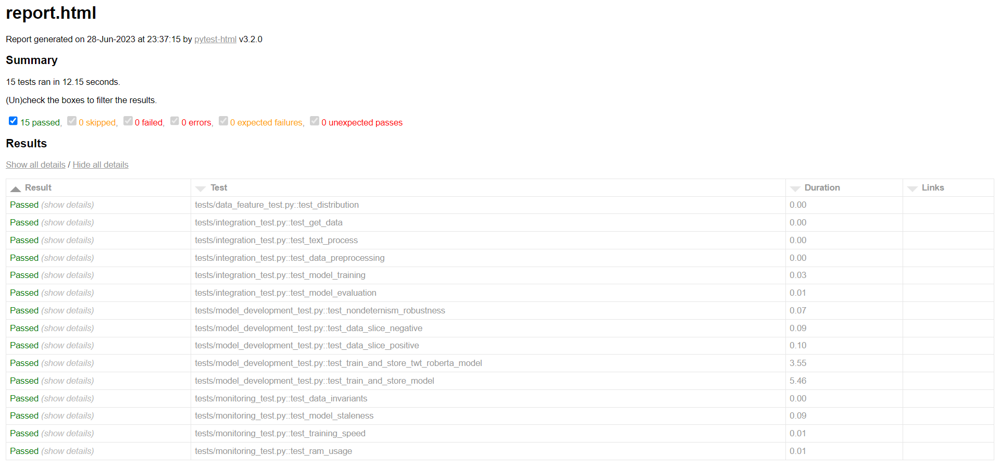
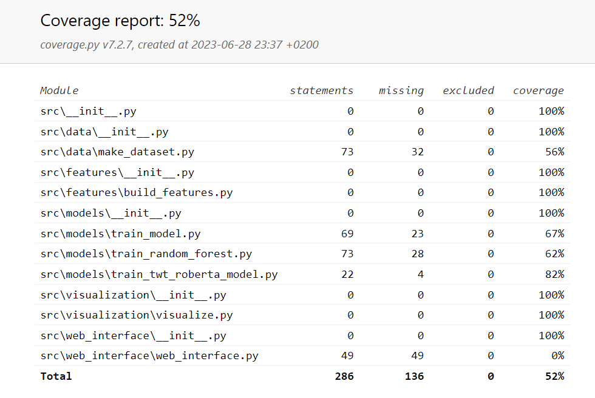

model-training
==============================

<small>Project based on the <a target="_blank" href="https://drivendata.github.io/cookiecutter-data-science/">cookiecutter data science project template</a>. #cookiecutterdatascience</small>

## Requirements
Python version:
- 3.8 or 3.9

## How to run the pipeline
Install poetry on Linux, macOS, Windows (WSL):
- `curl -sSL https://install.python-poetry.org | python3 - --version=1.5.0`

Install dependencies:
- `poetry install`

Pull the files from the DVC remote:
- `poetry run dvc pull`

Run the pipeline:
- `poetry run dvc repro`

To run the experiment:
- `poetry run dvc exp run`

To see the difference in the accuracy metric:
- `poetry run dvc metrics diff`

To see the experiment log:
- `poetry run dvc exp show`

## Code quality

To run dslinter:
- `poetry run pylint --load-plugins=dslinter tests src`

To run mllint:
- `poetry run mllint`, which will run all linters

## Tests

To run tests:
- `poetry run pytest`

To get a test report:
- `poetry run pytest --html=report.html`, and open up report.html in your browser.

To see a coverage report: 
- `poetry run pytest --cov=./src/ --cov-report html:coverage_report`, and open the coverage_report\index.html in your browser

Screenshot of test report:

Screenshot of coverage report:

