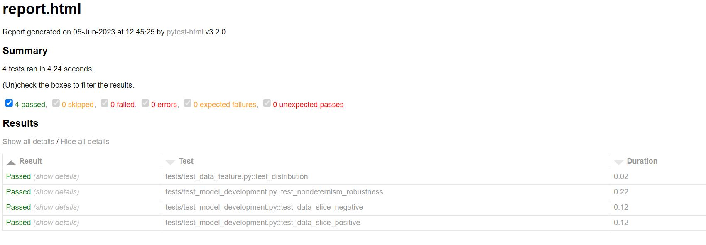
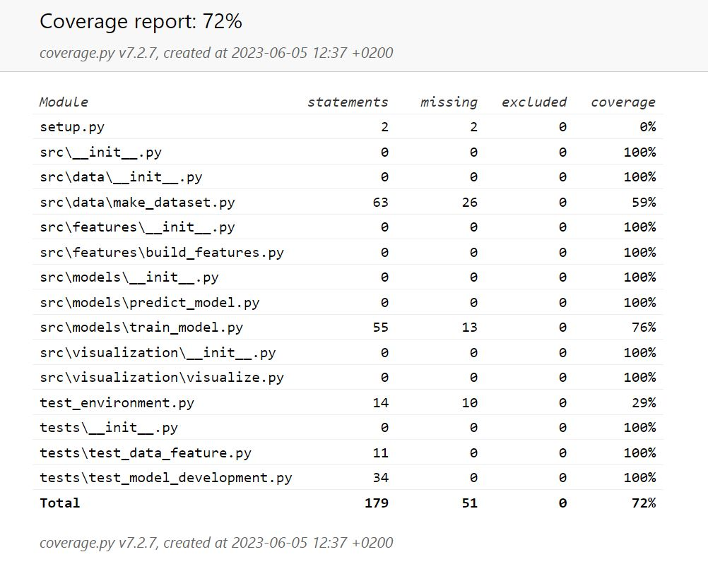

model-training
==============================

Project containing the model for restaurant reviews sentiment analysis

<small>Project based on the <a target="_blank" href="https://drivendata.github.io/cookiecutter-data-science/">cookiecutter data science project template</a>. #cookiecutterdatascience</small>

# How to run the pipeline

TODO: add how to install poetry, or what poetry version is required

Install dependencies:
- `poetry install`

Pull the files from the DVC remote:
- `poetry run dvc pull`

Run the pipeline:
- `poetry run dvc repro`

To run the experiment:
- `poetry run dvc exp run`

To see the difference in the accuracy metric:
- `poetry run dvc metrics diff`

To see the experiment log:
- `poetry run dvc exp show`

# Tests

To run tests:
- `poetry run pytest`

To get a test report:
- `poetry run pytest --html=report.html`, and open up report.html in your browser.

To see a coverage report (adequacy metric): 
- `poetry run pytest --cov=. --cov-report html:coverage_report`, and open the coverage_report\index.html in your browser

Screenshot of test report:

Screenshot of coverage report:

